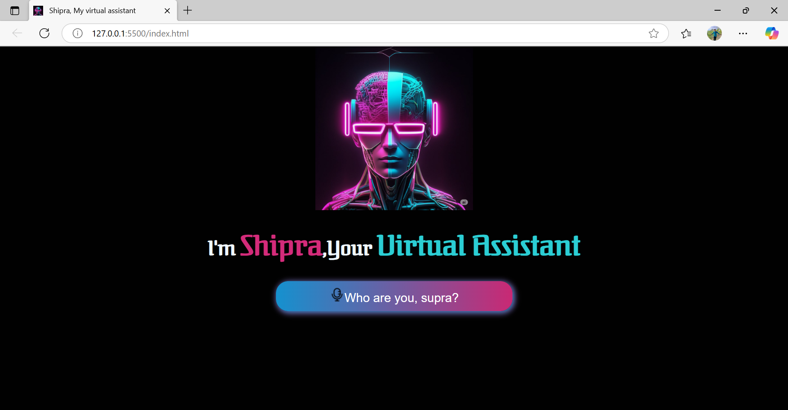
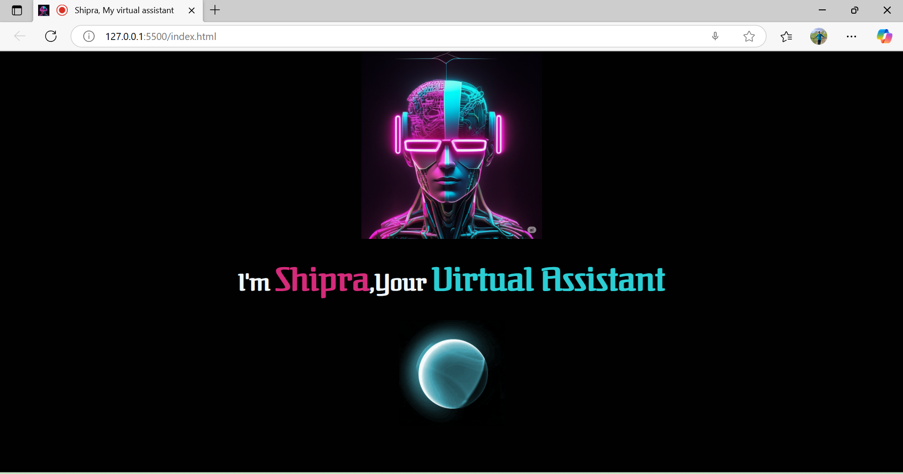

# 🤖 Virtual Assistant  

A simple yet powerful **Virtual Assistant** built using **HTML, CSS, and JavaScript**.  
This project can listen to user commands, respond with voice, and perform basic tasks like searching the web, opening sites, telling time/date, and more.  

---

## 🚀 Features  

✅ Voice Recognition using **Web Speech API**  
✅ Speech Output with natural voice  
✅ Handles basic commands (time, date, greetings, search, etc.)  
✅ Clean and responsive **UI with CSS**  
✅ Pure **JavaScript Implementation** (no external frameworks)  

---

## 🛠️ Tech Stack  

- **HTML5** → Structure  
- **CSS3** → Styling & Layout  
- **JavaScript (ES6)** → Logic & Voice Assistant Functionality  

---

## 📸 Screenshots  

### 🟢 Before Speaking  
  

### 🔴 After Speaking  
  
 

---

## 🎯 Future Enhancements  

- 🌐 Add more smart commands (weather, calculator, reminders, etc.)  
- 🧠 Integrate with APIs (Wikipedia, News, Weather API)  
- 📱 Build a mobile-friendly version  

---

## 👨‍💻 Author  

Developed by Prince Kumar Prem – Beginner Web Developer 🚀  
